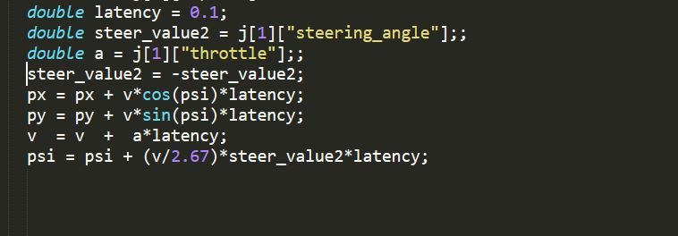

# Model-Predictive-Control-MPC
Self Driving Car Model Predictive Control (MPC) Project

# MPC Model

The purpose for the MPC model is to a line that is the path of the car and using the model to make the move on that line with the maximum accuracy.so first thing I define dt and N steps then I define equations for the model which contain X position , Y position ,velocity, cross track error and orientation error then I define cost function then I use IPOPT optimizer that take the constraints and the cost function and return vector with the minimum cost .

Model Equations: 
- X(t+1) = X(t) + V(t)*cos(psi(t))*dt
- Y(t+1) = Y(t) + V(t)*sin(psi(t))*dt
- psi(t+1) = psi(t) + V(t)/Lf*dalta(t)*dt
- V(t+1) = V(t) + a(t)*dt
- cte(t+1) = f(X(t)) - Y(t) + V(t)*sin(epsi(t))*dt
- epsi(t+1) = psi(t) - psi(des(t)) + V(t)/Lf*delta*dt


# N and dt

N parameter  is the number of total dt that we will make in each step if we multiply the N*dt the result will be the total time.

I choose N = 15 which make the model predict correctly and high speed if we increase the N the accuracy increase but the cost of computional time increase which make the model very slow.I choose 
dt I choose it as small as poosible to increase the accuracy if it too big there will be a big gap between the prediction situation and real situation so I choose it (dt= 0.1).


# way points 

I made some transformations on the points so that all the points will go to the same reference of the origin these will make the mathematics more easy and it will help in the poly_fit() function as all the point is transferred to origin.so I converted the fitted points from their coordinates frames to the origin or the car frame.

# latency

For the latency problem I made dt= 2.5 so that the latency time (100 ms) will be in that time . I modified the equation of my
model to take in consideration the latency.


```python
from IPython.core.display import Image
Image(filename=('C:/Users/DELL/latency_4.JPG'))
```





